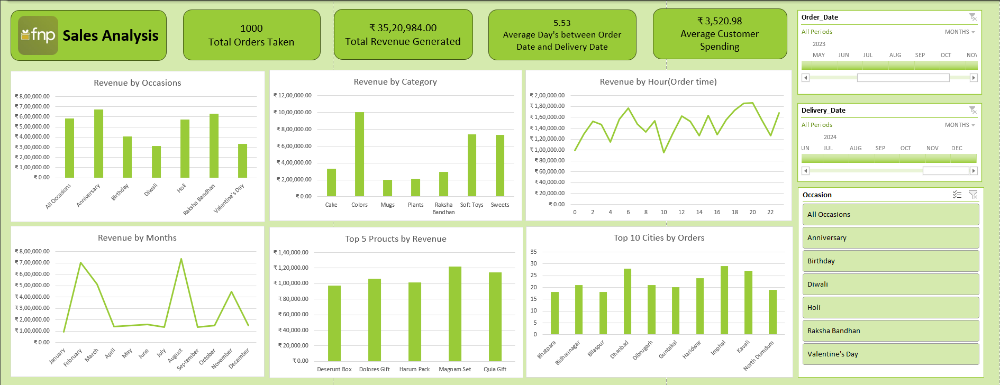

# Ferns N Petals (FNP) Sales Analysis  

## Dashboard Overview  
This project analyzes sales data from **Ferns N Petals (FNP)** — a company specializing in gifts for various occasions like Diwali, Raksha Bandhan, Holi, Valentine’s Day, Birthdays, and Anniversaries.  
The goal is to uncover insights into **sales trends, customer behavior, and product performance** to help optimize business strategies.  

---

## Problem Statement  
FNP aims to improve its sales strategy and customer satisfaction by analyzing order, delivery, and product data.  
The analysis addresses the following key business questions:  

- **Total Revenue** – Identify the overall revenue generated.  
- **Average Order & Delivery Time** – Evaluate how long it takes for orders to be delivered.  
- **Monthly Sales Performance** – Track sales fluctuations across 2023.  
- **Top Products by Revenue** – Find the highest revenue-generating products.  
- **Customer Spending Analysis** – Calculate the average spending per customer.  
- **Top 5 Products Sales Trend** – Track sales performance of top 5 products.  
- **Top 10 Cities by Orders** – Identify cities placing the most orders.  
- **Order Quantity vs Delivery Time** – Analyze if larger orders take longer to deliver.  
- **Revenue by Occasion** – Compare revenue across different occasions.  
- **Product Popularity by Occasion** – Identify which products are most popular during specific events.  

---

## Dashboard Insights  

| **Metric** | **Insight** |
|-------------|-------------|
| **Total Orders Taken** | 1000 |
| **Total Revenue Generated** | ₹35,20,984 |
| **Average Days Between Order & Delivery** | 5.53 days |
| **Average Customer Spending** | ₹3,520.98 |
| **Top Occasions** | Anniversary, Valentine’s Day, Diwali |
| **Top Categories** | Colors, Soft Toys, Sweets |
| **Top Products by Revenue** | Deserunt Box, Dolores Gift, Harum Pack, Magnam Set, Quia Gift |
| **Top Cities by Orders** | Ghaziabad, Delhi, Noida, Indore, Bhopal |

---

## Tools & Technologies Used  
- **Microsoft Excel / Power BI** – Dashboard creation & data visualization  
- **Data Cleaning** – Excel formulas and pivot tables  
- **Data Analysis** – Charts, slicers, and KPI metrics  

---

## Dashboard Preview  

---

## Key Learnings  
- Identified high-performing products and revenue-driving regions.  
- Observed peak sales during festive and romantic occasions.  
- Derived insights on customer spending patterns and delivery performance.  
- Developed experience in building interactive dashboards using Excel.  

---

## Created By  
**Then Daarnika**  
Data Analytics & Business Insights Enthusiast  
